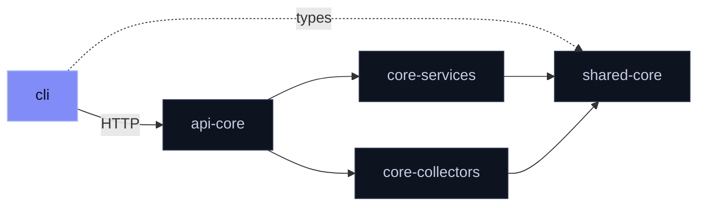

<div align="center">

# `@mira/cli`

**One command from question to answer.**

```
mira research "<query>"
```

[](https://www.npmjs.com/package/@mira/cli)
[](./LICENSE)

</div>

<br>

Posts a research job to a running [`@mira/api-core`](https://github.com/mira-js/api) server, waits for it to finish and prints the result as JSON.

## Install

```sh
npm install -g @mira/cli
```

Needs a running Mira API. Point at it with `MIRA_API_URL` (defaults to `http://localhost:3000`).

## Run

```console
$ mira research "invoicing software" --depth quick --sources reddit,hackernews
Queuing research: "invoicing software" (depth: quick)
Job queued: 1
Waiting.....

--- Result ---
{
  "query": "invoicing software",
  "summary": "...",
  "painPoints": [ ... ],
  "competitorWeaknesses": [ ... ],
  "emergingGaps": [ ... ],
  "rawItems": [ ... ]
}
```

| Option | |
|:--|:--|
| `--depth quick\|deep` | Research depth. Anything else falls back to `quick`. |
| `--sources a,b` | Comma-separated source slugs. Omit for the server default. |
| `--help`, `-h` | Print usage. |

> [!TIP]
> Progress lines print before the result, so the full output isn't plain JSON. Everything after `--- Result ---` is.

## Exit codes

| | |
|:--|:--|
| `0` | Job completed, or usage printed |
| `1` | Job failed, timed out, or an HTTP error occurred |

## Where it sits



The CLI talks to the API over HTTP only, and uses `shared-core` for types.

<details>
<summary><b>Build from source</b></summary>

<br>

Clone next to `shared` in a pnpm workspace, then:

```sh
pnpm install
pnpm --filter @mira/cli build
```

The `mira` binary lands in `dist/index.js`.

</details>

<br>

<div align="center">
<sub>
Part of <a href="https://github.com/mira-js">Mira's open core</a> ·
<a href="./LICENSE">AGPL-3.0-only</a> ·
<a href="https://github.com/mira-js/.github/blob/main/CONTRIBUTING.md">Contributing</a> (<a href="https://github.com/mira-js/.github/blob/main/CLA.md">CLA</a>) ·
<a href="https://github.com/mira-js/cli/security/advisories/new">Report a vulnerability</a>
<br>
Copyright (C) 2026 Fernando Nieto Pallares
</sub>
</div>
